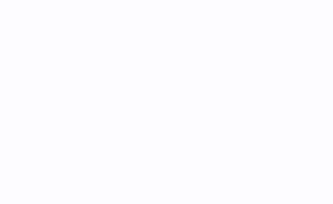

# ScrollContainer

可滚动容器，支持 UILabel 文本滚动(跑马灯效果)等，常规情况下，UIView 的子类都可以

[](https://github.com/ZuopanYao/ScrollContainer)
[](https://cocoapods.org/pods/ScrollContainer)

## Requirements / 使用条件

- iOS 11.0+ 
- Xcode 12.2+
- Swift 5.0+


## Installation / 安装

### CocoaPods

```
pod 'ScrollContainer'
```

### Manually / 手动安装

If you prefer not to use either of the aforementioned dependency managers, you can integrate SnapKit into your project manually.

如果您不喜欢以上管理依赖库的方式，则可以手动将 ScrollContainer 集成到项目中。


## Usage / 使用
```
let container = yourLabel.sc.scrollable()
view.addSubview(container)
    
container.snp.makeConstraints { (make) in
    make.top.equalToSuperview().offset(100)
    make.left.equalToSuperview().offset(30)
    make.width.equalTo(200)
    make.height.equalTo(40)
}
    
/// 滚动速度，一个必须大于1的值，越大速度越快，默认: 20.0
container.scrollSpeed = 20.0
    
/// 是否自动回退动画，默认: false
container.autoreverses = true
    
/// 滚动从哪个位置开始，默认: left
//container.scrollStart = .left
    
/// 动画结束后，维持最后的状态，默认: false
//container.isSaveLastStatus = false
    
/// 头尾部空隙,默认: 10.0
//container.leadAndTailGap = 10.0
    
/// 动画重复次数，默认: 无限次
//container.repeatCount = Float.greatestFiniteMagnitude

```

## Example

```
class ViewController: UIViewController {
    
    var container1: SCContainer!
    var container2: SCContainer!
    var container3: SCContainer!

    override func viewDidLoad() {
        super.viewDidLoad()
        
        let text = "开发商 Playground Games 表示，由于新作即将推出，他们将主要精力都投入了新作的最后准备，因此《极限竞速：地平线 4》已经基本停止了内容更新。"
        let width: CGFloat = view.width
        
        let tip1 = UILabel()
        tip1.text = "只滚动一次"
        tip1.textColor = .red
        tip1.frame = CGRect(x: 0, y: 90.0, width: width, height: 30.0)
        view.addSubview(tip1)
        
        let tip2 = UILabel()
        tip2.text = "不断来回滚动"
        tip2.textColor = .blue
        tip2.frame = CGRect(x: 0, y: 170.0, width: width, height: 30.0)
        view.addSubview(tip2)

        let tip3 = UILabel()
        tip3.text = "不断重复滚动"
        tip3.textColor = .purple
        tip3.frame = CGRect(x: 0, y: 250.0, width: width, height: 30.0)
        view.addSubview(tip3)

        let label1 = UILabel()
        label1.text = text
        label1.textColor = .red
        
        let label2 = UILabel()
        label2.text = text
        label2.textColor = .blue
        
        let label3 = UILabel()
        label3.text = text
        label3.textColor = .purple
        
        container1 = label1.sc.scrollable()
        container1.scrollStart = .left
        container1.scrollSpeed = 100.0
        container1.repeatCount = 1.0
        container1.frame = CGRect(x: 0.0, y: 120.0, width: width, height: 40.0)
        view.addSubview(container1)
        
        container2 = label2.sc.scrollable()
        container2.scrollStart = .middle
        container2.scrollSpeed = 100.0
        container2.autoreverses = true
        container2.frame = CGRect(x: 0.0, y: 200.0, width: width, height: 40.0)
        view.addSubview(container2)
        
        container3 = label3.sc.scrollable()
        container3.scrollStart = .right
        container3.scrollSpeed = 100.0
        container3.frame = CGRect(x: 0.0, y: 280.0, width: width, height: 40.0)
        view.addSubview(container3)
    }
}
```

Preview



## License / 许可证

ScrollContainer is released under the MIT license. See LICENSE for details.

ScrollContainer 是在 MIT 许可下发布的，有关详情请查看该许可证。